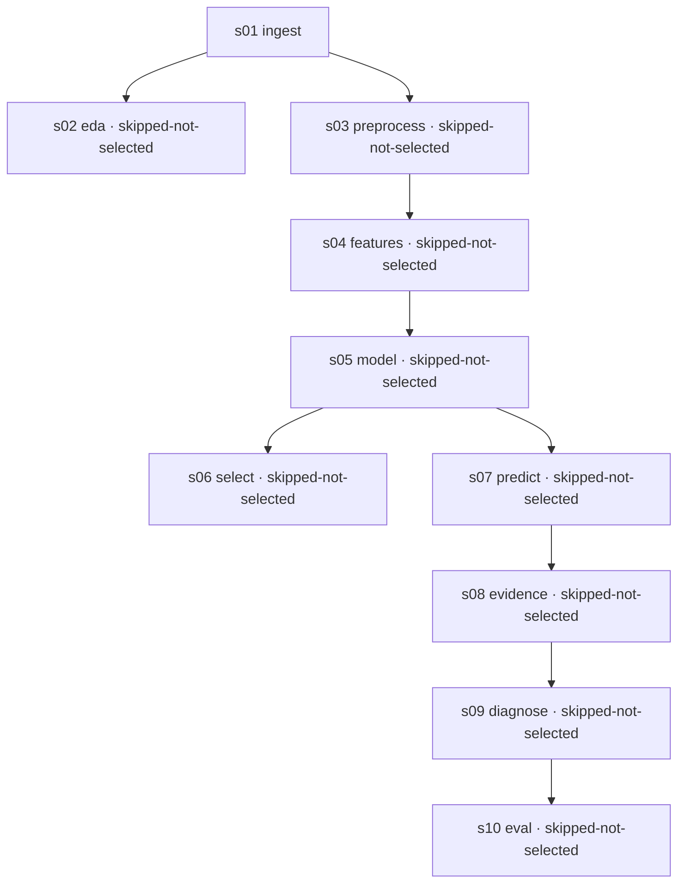

# Pipeline Run Manifest

- Run id: `run_b`  ·  stages executed: **1** (skipped: **1**)
- Seed: **42**  ·  dataset: **FD001**  ·  RUL cap: **125**  ·  git: `694b40e`
- Journal: `/tmp/pytest-of-lu2/pytest-24/test_run_stage_then_skip_secon0/journal.jsonl` (append-only NDJSON, one line per step event)

## Stage DAG

## Stage cards

### s01_ingest — ⏭ skipped (cached)

**What.** Load the raw C-MAPSS FD001 train/test text files into named columns and compute the capped training RUL target.

**Why.** Everything downstream refers to named sensors and a well-defined target; parsing the fixed-width files once here prevents silent column drift.

**功能.** 读入原始 C-MAPSS FD001 训练/测试数据，给每列起名，并算出封顶后的剩余寿命标签。

**目的.** 后面所有环节都按传感器名字来引用，先在这里一次性把固定宽度的文本解析好，避免列错位却没人发现。

- Observed: rows **n/a**, outputs **159 B**, time **0.000s**
- Inputs: `data/raw/CMAPSSData/train_FD001.txt`, `data/raw/CMAPSSData/test_FD001.txt`, `data/raw/CMAPSSData/RUL_FD001.txt`
- Outputs: `data/processed/ingest_manifest.json`
- Assumptions:
  - FD001 only: one operating condition, one fault mode (HPC degradation).
  - Training RUL is capped at 125 cycles — a documented modelling choice, not a property of the data.
