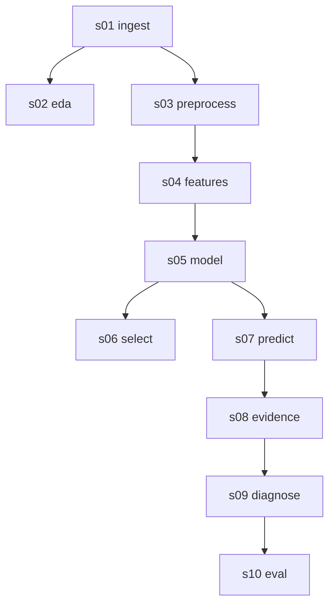

# Pipeline Run Manifest

- Run id: `run_20260706T225133976531Z`  ·  stages executed: **10** (skipped: **10**)
- Seed: **42**  ·  dataset: **FD001**  ·  RUL cap: **125**  ·  git: `31607d9`
- Journal: `reports/pipeline_journal.jsonl` (append-only NDJSON, one line per step event)

## Stage DAG

## Stage cards

### s01_ingest — ⏭ skipped (cached)

**What.** Load the raw C-MAPSS FD001 train/test text files into named columns and compute the capped training RUL target.

**Why.** Everything downstream refers to named sensors and a well-defined target; parsing the fixed-width files once here prevents silent column drift.

**功能.** 读入原始 C-MAPSS FD001 训练/测试数据，给每列起名，并算出封顶后的剩余寿命标签。

**目的.** 后面所有环节都按传感器名字来引用，先在这里一次性把固定宽度的文本解析好，避免列错位却没人发现。

- Observed: rows **n/a**, outputs **159 B**, time **0.001s**
- Inputs: `data/raw/CMAPSSData/train_FD001.txt`, `data/raw/CMAPSSData/test_FD001.txt`, `data/raw/CMAPSSData/RUL_FD001.txt`
- Outputs: `data/processed/ingest_manifest.json`
- Assumptions:
  - FD001 only: one operating condition, one fault mode (HPC degradation).
  - Training RUL is capped at 125 cycles — a documented modelling choice, not a property of the data.

### s02_eda — ⏭ skipped (cached)

**What.** Explore the training data: rank sensors by how monotonically they track wear, list the flat sensors with evidence, and chart the unit-lifetime distribution.

**Why.** Names the degradation carriers, justifies which sensors are dropped, and explains why RUL is capped and why short-history units are hard.

**功能.** 先摸清训练数据：按传感器和磨损的单调相关性排个序，把几乎不变的'哑'传感器连同证据列出来，再画出每台发动机寿命长短的分布。

**目的.** 这样能点名到底哪些传感器带着退化信号、为什么要丢掉某些传感器，也讲清楚为什么剩余寿命要封顶、为什么历史太短的机组最难判断。

- Observed: rows **n/a**, outputs **96.0 KB**, time **0.001s**
- Inputs: `data/raw/CMAPSSData/train_FD001.txt`
- Outputs: `reports/eda_summary.md`, `reports/eda/eda_summary.json`, `reports/eda/monotonicity.png`, `reports/eda/flat_sensors.png`, `reports/eda/lifetime_distribution.png`
- Assumptions:
  - Monotonicity is measured by Pearson correlation of the raw sensor value with remaining useful life across all training rows.
  - 'Flat' means (near-)constant on FD001 train; such sensors carry no degradation signal here but may matter on other conditions.

### s03_preprocess — ⏭ skipped (cached)

**What.** Fix the preprocessing policy: drop the near-constant sensors and all op-settings, keep the 14 informative sensors, and record the leakage guards.

**Why.** A single, recorded drop-list plus the group-by-unit / cap-on-target-only rules keep training honest and reproducible across stages.

**功能.** 定下预处理规矩：丢掉几乎不变的传感器和全部工况设置，留下 14 个有信息量的传感器，并把防数据泄漏的做法记录下来。

**目的.** 有一份写死的丢弃清单，加上'按机组分组、只对标签封顶'这些规矩，训练才诚实、各环节才可复现。

- Observed: rows **n/a**, outputs **888 B**, time **0.001s**
- Inputs: `data/processed/ingest_manifest.json`
- Outputs: `data/processed/preprocess_summary.json`
- Assumptions:
  - No per-sensor z-scoring: the tree model is scale-invariant, so it is intentionally omitted here.
  - Leakage guards (group-by-unit CV, cap on target only, no future-window info) are declared here and honoured by later stages.

### s04_features — ⏭ skipped (cached)

**What.** Build the modelling feature matrix: each informative sensor plus its per-unit rolling mean and rolling std (window 5).

**Why.** The rolling mean denoises the raw signal and the rolling std captures rising volatility as a fault develops — cheap, explainable features.

**功能.** 搭出喂给模型的特征表：每个有用传感器，加上它按机组算的滑动均值和滑动标准差（窗口 5）。

**目的.** 滑动均值把原始信号去噪，滑动标准差抓住故障发展时的波动变大——都是便宜又能讲清楚的特征。

- Observed: rows **n/a**, outputs **1.0 KB**, time **0.001s**
- Inputs: `data/processed/preprocess_summary.json`, `data/raw/CMAPSSData/train_FD001.txt`
- Outputs: `data/processed/feature_spec.json`
- Assumptions:
  - Rolling windows are computed within each unit so history never leaks across engines.
  - 14 sensors x (value + roll_mean + roll_std) = 42 features; no FFT, no cross-sensor interactions.

### s05_model — ⏭ skipped (cached)

**What.** Train the RandomForest RUL regressor on the training features and save the model, its feature importances, and training metadata.

**Why.** A tree ensemble is accurate enough and self-explaining (per-feature importances), which the evidence and diagnostic layers reuse.

**功能.** 用训练特征训练随机森林剩余寿命回归模型，保存模型、特征重要性和训练元数据。

**目的.** 随机森林准确度够用，又能自己说清每次判断靠哪些传感器（特征重要性），证据层和诊断层都直接复用这一点。

- Observed: rows **n/a**, outputs **80.0 MB**, time **0.001s**
- Inputs: `data/processed/feature_spec.json`, `data/raw/CMAPSSData/train_FD001.txt`
- Outputs: `models/rul_baseline.joblib`, `data/processed/feature_importances.csv`, `data/processed/model_meta.json`
- Assumptions:
  - RandomForest(n_estimators=200, min_samples_leaf=3, max_features='sqrt') with random_state=42 — deterministic given the seed.
  - Trained on the capped target; predictions for very healthy units are compressed toward the 125 cap by construction.

### s06_select — ⏭ skipped (cached)

**What.** Record the champion model. Phase A has a single candidate (RandomForest), selected by grouped-CV RMSE with a simplicity tiebreak; Phase B adds the Ridge floor and HistGBM challenger.

**Why.** Choosing the champion is a governed decision (never the highest score alone), so the rationale is written down as an artifact from the start.

**功能.** 记录当选的冠军模型。A 阶段只有随机森林一个候选，按分组交叉验证的RMSE 选出、并以简单性做决胜；B 阶段再加 Ridge 下限和 HistGBM 挑战者。

**目的.** 选谁当冠军是一个要讲规矩的决定（不是单看谁分高），所以从一开始就把选择理由写成一份可查的产物。

- Observed: rows **n/a**, outputs **677 B**, time **0.001s**
- Inputs: `data/processed/model_meta.json`
- Outputs: `data/processed/champion.json`
- Assumptions:
  - Phase A: one candidate, so selection is a pass-through that records the RandomForest as champion with its metrics.
  - The champion swaps behind the prediction interface; evidence/RAG layers are unchanged when a challenger later wins.

### s07_predict — ⏭ skipped (cached)

**What.** Load the saved model, score every test unit at its last cycle, and write the predictions contract, the metrics file, and the figures.

**Why.** Prediction is a standalone, reusable tool (the agent calls it per unit); splitting it from training makes each independently runnable.

**功能.** 载入保存好的模型，对每台测试发动机在它最后一个周期打分，产出预测结果、指标文件和图表。

**目的.** 预测是一个独立、可复用的工具（智能体会按机组调用它），把它从训练里拆出来，两边就都能单独跑。

- Observed: rows **n/a**, outputs **336.7 KB**, time **0.001s**
- Inputs: `models/rul_baseline.joblib`, `data/processed/feature_importances.csv`, `data/processed/model_meta.json`, `data/raw/CMAPSSData/test_FD001.txt`, `data/raw/CMAPSSData/RUL_FD001.txt`
- Outputs: `data/processed/test_predictions.csv`, `reports/metrics_model.json`, `reports/figures/pred_vs_true.png`, `reports/figures/error_hist.png`, `reports/figures/degradation_units.png`
- Assumptions:
  - Scored at each unit's LAST recorded cycle vs the official RUL vector.
  - Predictions are clipped at 0; risk bands use the 30/80 cutoffs; both capped and uncapped metrics are reported.

### s08_evidence — ⏭ skipped (cached)

**What.** Assemble one structured evidence record per test unit: prediction, top contributing signals, a last-window sensor summary, and the honest uncertainty note.

**Why.** The evidence record is the grounded hand-off to the diagnostic assistant — true RUL is carried only as eval-only, never as a signal.

**功能.** 给每台测试发动机整理一份结构化证据：预测值、贡献最大的信号、最后一段窗口的传感器小结，以及一段实话实说的不确定性说明。

**目的.** 这份证据是交给诊断助手的、可溯源的依据——真实剩余寿命只作评测用，绝不当作输入信号。

- Observed: rows **n/a**, outputs **4.3 KB**, time **0.001s**
- Inputs: `data/processed/test_predictions.csv`, `data/processed/feature_importances.csv`, `data/raw/CMAPSSData/test_FD001.txt`
- Outputs: `data/processed/evidence/_evidence_manifest.json`
- Assumptions:
  - Ground-truth RUL appears only under 'true_rul_eval_only'; it is never fed to the model or the assistant.
  - Sensor trends are summarised over the last 30 cycles for the top-6 importance-ranked sensors.

### s09_diagnose — ⏭ skipped (cached)

**What.** Run the deterministic, grounded diagnostic assistant over every evidence record and persist one cited report per unit.

**Why.** Pre-computing the diagnoses gives the agent and app a ready, auditable per-unit report where every claim traces to a KB citation.

**功能.** 对每一份证据记录跑一遍确定性的、有据可依的诊断助手，为每台机组存下一份带引用的报告。

**目的.** 事先把诊断算好，智能体和界面就有一份现成、可审计的逐机组报告，每句结论都能追到知识库里的出处。

- Observed: rows **n/a**, outputs **4.6 KB**, time **0.001s**
- Inputs: `data/processed/evidence/_evidence_manifest.json`, `docs/knowledge_base/anomaly_review_guidelines.md`, `docs/knowledge_base/failure_modes.md`, `docs/knowledge_base/human_in_loop_policy.md`, `docs/knowledge_base/maintenance_review_checklist.md`, `docs/knowledge_base/rul_interpretation.md`
- Outputs: `data/processed/diagnostics/_diagnostics_manifest.json`
- Assumptions:
  - No LLM: the report is composed by template from retrieved KB chunks; if nothing is retrieved it says so rather than inventing a cause.
  - human_review_required is always true; every report carries the fixed safety note.

### s10_eval — ⏭ skipped (cached)

**What.** Run the three-section evaluation harness (model metrics, retrieval hit@k, diagnostic-output governance) and write the evaluation summary.

**Why.** The governance checks are the point of the project: no diagnostic ships without citations, uncertainty, a human-review flag, and grounded claims.

**功能.** 跑三段式评测（模型指标、检索命中率、诊断输出治理检查），并写出评测总结。

**目的.** 治理检查正是这个项目的核心：任何诊断都不能没有引用、不确定性说明、人工复核标记和可溯源的结论就发出去。

- Observed: rows **n/a**, outputs **3.8 KB**, time **0.001s**
- Inputs: `data/processed/test_predictions.csv`, `reports/metrics_model.json`, `data/processed/evidence/_evidence_manifest.json`, `docs/knowledge_base/anomaly_review_guidelines.md`, `docs/knowledge_base/failure_modes.md`, `docs/knowledge_base/human_in_loop_policy.md`, `docs/knowledge_base/maintenance_review_checklist.md`, `docs/knowledge_base/rul_interpretation.md`
- Outputs: `reports/evaluation_summary.md`
- Assumptions:
  - Recomputed RMSE/MAE are cross-checked against metrics_model.json (uncapped truth) to catch artifact drift.
  - Each section degrades to a clear 'pending' note if its inputs are absent, so the harness always runs.
